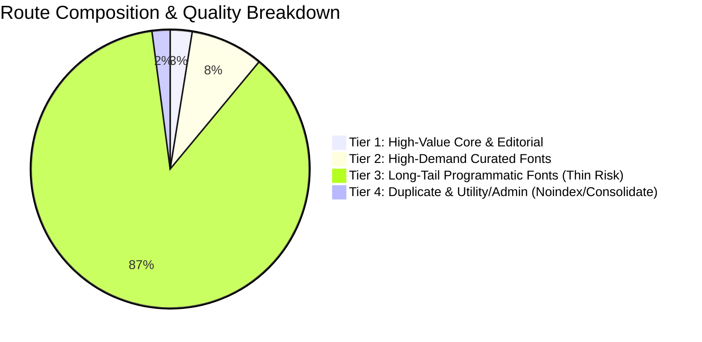
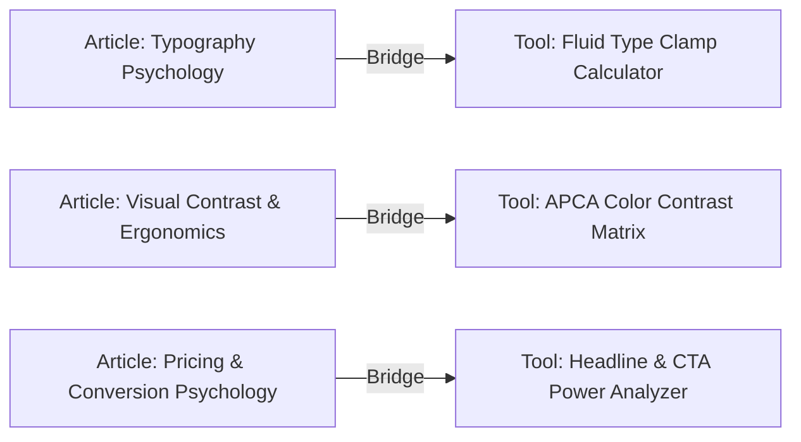

# ORGANIC GROWTH & PRODUCT ARCHITECTURE AUDIT

**Date**: 2026-08-18  
**Author**: Primary Implementation Engineer (Antigravity AI)  
**Status**: COMPLETE STRATEGIC BLUEPRINT  
**Target Platform**: Rvan.me (`https://www.rvan.me`)  
**Scope**: Route Quality Analysis, Editorial Content, Interactive Tools, Creative Resources, Sanity CMS, SEO Indexing, Internal Linking, Differentiation, Retention, and Execution Roadmap.

---

## 1. Executive Summary

Rvan.me is currently in a pivotal transition from a personal creative portfolio into a **high-utility, production-grade digital platform** uniting three core pillars:
* **LEARN**: 39 long-form, curiosity-driven editorial essays on Design, Marketing, Psychology, and Culture.
* **USE**: Interactive client-side utilities including an ATS-compliant Resume/CV Builder and an Open Peeps Vector Character Generator.
* **DISCOVER**: A directory of 1,700+ Google Fonts, thousands of Lucide icons, Open Doodles illustrations, and curated opportunities.

### Key Audit Findings
1. **The Core Asset Strength**: The 39 master editorial essays in `src/lib/blogs/` represent exceptional, publication-grade assets with average reading times of 8–9 minutes. They establish a solid foundation for topical authority in design psychology, pricing models, and visual ergonomics.
2. **The 4,719 Route Problem**: Of the 4,719 pre-rendered routes generated at build time, **~97.5% (~4,600 routes) are automated font specimen pages**. The majority of obscure, single-weight fonts risk being classified as "thin or duplicate programmatic content" by search engines, diluting domain authority and wasting crawl budget.
3. **The Sitemap Divergence Bug**: `scripts/generate-seo-pages.mjs` generates a complete static `dist/sitemap.xml` (with 4,719 URLs and hreflang tags), but `vercel.json` rewrites `/sitemap.xml` to `api/sitemap.ts`. The serverless API currently only serves ~10 static English URLs, completely omitting all Azerbaijani `/az/*` routes, font detail pages, tool detail pages, and hreflang annotations.
4. **Siloed Value Nodes**: The three pillars currently exist in isolation. A reader on a pricing psychology article is not guided to a relevant marketing calculator; a user of the ATS Resume Builder is not linked to career typography articles or font pairing resources.
5. **Untapped Authentication**: Google OAuth currently functions as a login toggle without delivering personalized user utility (such as saving favorite articles, font pairings, or resume drafts).

---

## 2. Current Product Assessment

```
                      ┌─────────────────────────────────┐
                      │             RVAN.ME             │
                      │   Digital Product Ecosystem     │
                      └────────────────┬────────────────┘
                                       │
         ┌─────────────────────────────┼─────────────────────────────┐
         ▼                             ▼                             ▼
   ┌───────────┐                 ┌───────────┐                 ┌───────────┐
   │   LEARN   │                 │    USE    │                 │ DISCOVER  │
   │ 39 Master │                 │ Interactive│                │ 1,700+    │
   │ Editorial │                 │ Web Tools │                 │ Fonts,    │
   │  Essays   │                 │  (ATS CV, │                 │ Icons,    │
   │ (EN & AZ) │                 │  Avatars) │                 │ Assets    │
   └─────┬─────┘                 └─────┬─────┘                 └─────┬─────┘
         │                             │                             │
         └─────────────────────────────┼─────────────────────────────┘
                                       ▼
                   ┌───────────────────────────────────────┐
                   │  MISSING GLUE: TOPICAL CLUSTERS &     │
                   │  CONTEXTUAL INTERNAL LINKING BRIDGES  │
                   └───────────────────────────────────────┘
```

| Dimension | Current State | Assessment | Opportunity |
| :--- | :--- | :--- | :--- |
| **Topical Authority** | 39 deep essays in 5 thematic areas | High Quality, Low Interconnection | Interlink essays with related tools, resources, and concept clusters |
| **Tool Utility** | 2 working tools (Resume, Open Peeps) | High Utility, Limited Breadth | Add 3 high-demand calculators (Typography clamp, APCA contrast, CTA analyzer) |
| **Resource Hub** | 1,700+ fonts, Lucide icons, Open Doodles | Massive Catalog, Weak Curation | Tier indexation to top 200 fonts; enrich with specimen pairing sandboxes |
| **SEO Pipeline** | 4,719 SSG HTMLs + serverless sitemap | Disconnected & Crawl Heavy | Unify sitemaps, tier font indexation, canonicalize duplicate profiles |
| **Localization** | 100% Azerbaijani blog & UI parity | Rare Market Advantage | Maintain first-class AZ SEO dominance in the Caucasus & international tech |
| **User Retention** | Google Auth with no data store | Low Return Incentive | Enable saved collections, local+cloud resume sync, bookmarked tools |

---

## 3. Route Quality & Indexation Analysis (4,719 Routes)

To prevent Google Panda/Helpful Content penalties and optimize crawl budget, all 4,719 routes are classified into actionable indexation tiers:



### 3.1 Route Quality Tier Matrix

| Classification | Route Count | Examples | Quality Assessment | Strategic Recommendation |
| :--- | :--- | :--- | :--- | :--- |
| **Tier 1: High-Value Indexable** | ~120 | `/`, `/az`, `/blog/*`, `/az/blog/*`, `/tools/resume-builder`, `/tools/open-peeps`, `/about`, `/contact`, `/work/*` | **Exceptional**. Unique editorial text, high user dwell time, rich schema, full translations. | **Priority Indexing**. Maximum sitemap priority (0.9–1.0), daily/weekly change frequency. |
| **Tier 2: Potentially Valuable (Curated Resources)** | ~400 | Top 200 Google Fonts (e.g. `/fonts/inter`, `/fonts/roboto`, `/fonts/playfair-display`) + AZ pairs | **Good**. High search volume queries ("inter font free download", "playfair display specimen"). | **Index with Enhanced Specimen Sandbox**. Include font pairings, CSS clamp generator snippet, license info. |
| **Tier 3: Thin / Low-Value Programmatic** | ~4,100 | Obscure fonts with single weights, zero search volume, automated template text | **Thin / Duplicate Risk**. 2,300 AZ font routes have English descriptions with `(AZ)` appended to title. | **Crawl Optimization**. Remove from primary sitemap; render dynamically for users; allow organic discovery via main catalog. |
| **Tier 4: Duplicate Profile Routes** | 6 | `/ravanmammadov`, `/ravan-mammadov`, `/profile` (EN & AZ) | **Duplicate Content Risk**. 3 URLs rendering identical founder CV content. | **Consolidate**. Set canonical to `/ravan-mammadov` (and `/az/ravan-mammadov`); 301 redirect `/profile` and `/ravanmammadov`. |
| **Tier 5: Admin & Utility Routes** | 4 | `/admin/linkedin`, `/az/admin/linkedin` | **Security / Indexation Error**. Admin control panels are currently in sitemap! | **Strict Noindex**. Remove from sitemap, inject `<meta name="robots" content="noindex, nofollow">`, block in `robots.txt`. |

---

## 4. Editorial Content Analysis (39 Master Essays)

The 39 publication essays in `src/lib/blogs/` represent the cornerstone of the platform's organic search moat. They are organized into 5 cohesive topic clusters:

### 4.1 Thematic Cluster Breakdown

```
                             TOPIC CLUSTERS
                                   │
      ┌────────────────┬───────────┼───────────┬────────────────┐
      ▼                ▼           ▼           ▼                ▼
┌───────────┐    ┌───────────┐┌───────────┐┌───────────┐  ┌───────────┐
│ 1. DESIGN │    │2. MARKETING││ 3. DESIGN││4. TYPOGRA-│  │5. CREATIVE│
│PSYCHOLOGY │    │PSYCHOLOGY ││  HISTORY  ││    PHY    │  │  CULTURE  │
│ (8 Posts) │    │ (8 Posts) ││ (8 Posts) ││ (4 Posts) │  │ (11 Posts)│
└───────────┘    └───────────┘└───────────┘└───────────┘  └───────────┘
```

#### Cluster 1: Design Psychology & Visual Ergonomics (8 Essays)
* **Core Topics**: Visual hierarchy (`why-eyes-look-at-certain-things-first`), Gestalt proximity, corner radius psychology, OLED dark mode, negative space, Von Restorff contrast effect.
* **Search Intent**: Educational & conceptual queries ("why visual hierarchy matters", "psychology of corner radius in UI", "gestalt proximity in web design").
* **Internal Linking Potential**:
  - Link from *Visual Hierarchy* to **Fluid Typography Scale Tool** and **ATS Resume Builder** (layout hierarchy).
  - Link from *Corner Radius & Contrast* to **Color Contrast Matrix Tool**.

#### Cluster 2: Pricing, Conversion & Marketing Psychology (8 Essays)
* **Core Topics**: Left-digit bias (`why-999-feels-cheaper-than-1000`), menu price anchoring, free effect, scarcity principles (`only 3 left`), social proof on pricing tables, value framing.
* **Search Intent**: Growth marketers, SaaS founders, e-commerce designers ("pricing table psychology", "decoy pricing effect", "left-digit bias in SaaS").
* **Internal Linking Potential**:
  - Link from *Pricing Psychology* to future **Marketing CTA Analyzer Tool** and **Price Tier Mockup Generator**.

#### Cluster 3: Design History & Skeuomorphic Metaphors (8 Essays)
* **Core Topics**: Hamburger menu origin (Norm Cox 1981), Floppy disk save icon, Magnifying glass search, 1960s phone receiver, Gear settings, Trash can delete.
* **Search Intent**: Designers, design historians, curious tech users ("why is save icon a floppy disk", "origin of hamburger menu", "history of settings icon").
* **Internal Linking Potential**:
  - Link from *Icon History* directly to **Lucide Icons Catalog** and **Open Doodles Vector Hub**.

#### Cluster 4: Typography & Brand Semantics (4 Essays)
* **Core Topics**: Helvetica corporate dominance, Comic Sans hatred, font psychology and perceived expense, font personality shifts.
* **Search Intent**: Graphic designers, brand strategists, font enthusiasts ("why do luxury brands use serif fonts", "history of helvetica in corporate america").
* **Internal Linking Potential**:
  - Direct contextual bridges to **1,700+ Google Fonts Directory**, individual font specimen pages (e.g. Inter, Playfair Display), and **Typography Scale Tool**.

#### Cluster 5: Creative Culture, AI & Industry (11 Essays)
* **Core Topics**: Modern web homogenization, AI image uncanny valley, AI writing RLHF convergence, luxury empty space, micro-influencer trust, Google search position bias.
* **Search Intent**: Digital creators, agency directors, AI researchers ("why do all modern websites look identical", "why ai generated writing sounds the same").
* **Internal Linking Potential**:
  - Link from *AI Essays* to curated **AI Tools & Automation Directory** and **Open Source Resources**.

---

## 5. Tool Strategy & Analysis

### 5.1 Existing Tools Audit

#### Tool 1: ATS Resume & CV Builder (`/tools/resume-builder`)
* **Functional Assessment**: ⭐⭐⭐⭐⭐ (Production Grade)
  - Features: Real-time split-screen editing, ATS compliance audit score (0–100%), 5 clean templates (Minimal, Modern, Executive, Technical, Creative), print safe zone indicators, instant vector PDF export (<300KB).
  - Localization: 100% bilingual (English & Azerbaijani).
* **SEO & Growth Potential**: **Extremely High**. High search intent keywords ("free ats resume builder", "developer cv builder open source", "ats friendly cv generator").
* **Gaps**: Lacks section drag-and-drop reordering; no cloud save to Firebase Auth; lacks JSON import/export.

#### Tool 2: Open Peeps Character Builder (`/tools/open-peeps`)
* **Functional Assessment**: ⭐⭐⭐⭐☆ (Solid & Creative)
  - Features: Modular character customization (head, hair, expression, body, pose, accessories), multi-format export (SVG, EPS, PNG).
* **SEO & Growth Potential**: **Medium-High**. Keywords: "vector avatar generator", "open peeps character builder", "hand drawn illustration maker".
* **Gaps**: Lacks preset character randomization button; no color palette theme picker.

### 5.2 Next Flagship Candidate Tools (Prioritized by Search & Value)



1. **Fluid Typography & Clamp Calculator** (`/tools/typography-scale`):
   - *Utility*: Computes exact `clamp(min, preferred, max)` CSS values based on viewport breakpoints with live interactive preview.
   - *Synergy*: Deeply connects to the Typography cluster and Google Fonts catalog.
2. **Color Contrast & APCA Matrix Evaluator** (`/tools/contrast-matrix`):
   - *Utility*: Live WCAG 2.2 and APCA contrast checker for full design system palettes with export to Tailwind CSS config.
   - *Synergy*: Connects to Design Psychology, Dark Mode, and Accessibility essays.
3. **Marketing Headline & CTA Impact Analyzer** (`/tools/headline-analyzer`):
   - *Utility*: Scores headline strength, reading level, power words, and emotional appeal with actionable copy suggestions.
   - *Synergy*: Connects to Pricing and Marketing Psychology essays.

---

## 6. Resource Strategy (Fonts, Icons, Assets)

### 6.1 Google Fonts Catalog (`/resources?category=fonts` & `/fonts/:slug`)
* **Current State**: 1,700+ fonts in JSON database with live specimen rendering, weight selection, and CSS `@import` snippets.
* **Problem**: 2,300 font pages generated per language leads to 4,600 thin pages.
* **Strategic Solution**:
  - **Curated Tier 1 (Top 200 Fonts)**: Pre-render with rich editorial descriptions, pairings (e.g. "Pair Inter with Playfair Display"), and inclusion in the primary sitemap.
  - **Long-Tail Catalog (Remaining 1,500 Fonts)**: Keep available in the interactive client-side directory and render on demand via SPA fallback, avoiding index bloat.

### 6.2 Lucide Vector Icons (`/resources?category=icons`)
* **Current State**: Searchable icon grid with category filters, size, stroke, and color customizers.
* **Opportunity**: Add one-click copy buttons for React JSX (`<Camera size={24} />`), SVG path code, and Lucide React import statements.

---

## 7. CMS Architecture Audit (Sanity.io)

### 7.1 Current Schema Limitations
* **Document Types**: `blog`, `news`, `projects`, `resource`, `siteSettings`, `about`.
* **Identified Weaknesses**:
  1. *Author Modeling*: Author is currently stored as a flat string or schema fallback rather than a dedicated `author` reference document.
  2. *Ecosystem Linking*: Articles lack explicit Sanity array fields for `relatedTools` and `relatedResources`.
  3. *Taxonomy Hierarchy*: Categories are flat strings (`Design Psychology`, `Marketing`) without dedicated category landing page schemas.
  4. *Asset Deduplication*: In-memory TypeScript registries (`articles01to10.ts`) and Sanity cloud datasets must maintain automated two-way synchronization via `scripts/syncAllBlogsToSanity.mjs`.

### 7.2 Recommended Future CMS Model
```
Sanity Schema:
├── document "article"
│   ├── title / title_az
│   ├── slug / slug_az
│   ├── cluster (reference -> "topicCluster")
│   ├── author (reference -> "author")
│   ├── relatedArticles (array -> reference to "article")
│   ├── relatedTools (array -> reference to "tool")
│   ├── relatedResources (array -> reference to "resource")
│   └── seo (object -> title, description, ogImage, canonical)
```

---

## 8. SEO Architecture & Indexing Strategy

### 8.1 The Sitemap Conflict Resolution
* **Current Bug**: `vercel.json` rewrites `/sitemap.xml` to `/api/sitemap`, serving an incomplete sitemap without AZ routes or font pages.
* **Fix Strategy**:
  1. Update `api/sitemap.ts` or route `/sitemap.xml` directly to `dist/sitemap.xml`.
  2. Ensure `dist/sitemap.xml` contains:
     - All Core Pages (EN & AZ)
     - All 39 Master Editorial Articles (EN & AZ) with `xhtml:link` alternates
     - All Interactive Tools (EN & AZ)
     - Top 200 Curated Font Pages (EN & AZ)
     - Zero admin routes (`/admin/linkedin` excluded)

### 8.2 Canonical URL Rules
* `/ravanmammadov` → `<link rel="canonical" href="https://www.rvan.me/ravan-mammadov" />`
* `/profile` → `<link rel="canonical" href="https://www.rvan.me/ravan-mammadov" />`
* `/az/ravanmammadov` → `<link rel="canonical" href="https://www.rvan.me/az/ravan-mammadov" />`
* `/az/profile` → `<link rel="canonical" href="https://www.rvan.me/az/ravan-mammadov" />`
* `/fonts` → 301 redirect / canonical to `/resources?category=fonts`

---

## 9. Internal Linking & Ecosystem Flywheel

### 9.1 The Three-Way Contextual Linking Architecture

```
                                  [ ARTICLE ]
                       "Why Visual Hierarchy Matters"
                                      │
            ┌─────────────────────────┴─────────────────────────┐
            ▼                                                   ▼
     [ RELEVANT TOOL ]                                 [ RELEVANT RESOURCE ]
   ATS Resume Builder                                 Google Font: Inter
(Demonstrates text hierarchy)                       (Neutral sans-serif specimen)
            │                                                   │
            └─────────────────────────┬─────────────────────────┘
                                      ▼
                               [ NEXT ARTICLE ]
                      "Why Negative Space Feels Expensive"
```

### 9.2 In-Article Contextual Callout Widget
Every article will feature a dedicated **"Interactive Utility Bridge"** card embedded within the body or at the conclusion:
* *Example on Pricing Psychology post*:  
  > 🛠️ **Try the Tool**: Test your pricing tier labels and calculate perceptual contrast in our **[Marketing CTA Analyzer](/tools/headline-analyzer)**.
* *Example on Typography post*:  
  > 🔤 **Explore Typeface**: Test live weights and download **[Playfair Display on Rvan.me Fonts](/fonts/playfair-display)**.

---

## 10. Product Differentiation Matrix

| Competitor Type | Competitor Characteristics | Rvan.me Differentiator |
| :--- | :--- | :--- |
| **Generic Design Portfolios** | Self-promotional showcase, static images, zero utility for visitors. | **Product Platform**: Features deep editorial publication and production-ready in-browser tools. |
| **Generic Marketing / AI Blogs** | Shallow AI-written listicles ("Top 10 AI Tools in 2026"), high bounce rate. | **Cognitive Depth**: Original, research-backed essays explaining *why* humans react to design and pricing patterns. |
| **Resume Builder SaaS (Novoresume, Canva)** | Heavy paywalls, forced subscriptions, PDF export watermarks, data tracking. | **100% Free & Client-Side**: Pure vector PDF compilation, zero paywalls, zero telemetry on user resume data. |
| **Resource Directories (FreebiesBug, etc.)** | Cluttered ad-heavy affiliate links, broken downloads, no educational context. | **Curated & Integrated**: Fast specimen sandboxes, one-click code copy, directly linked to theoretical design essays. |

---

## 11. User Retention & Account Value Strategy

### Transforming Google Auth into a Personal Creative Stack:
```
┌─────────────────────────────────────────────────────────────┐
│                   MY CREATIVE WORKBENCH                     │
├──────────────────────────────┬──────────────────────────────┤
│ 📚 Saved Reading List        │ 🔤 Pinned Font Pairings      │
│ • Why Negative Space Works   │ • Inter + Playfair Display   │
│ • Pricing Decoy Psychology   │ • JetBrains Mono (Code)      │
├──────────────────────────────┼──────────────────────────────┤
│ 📄 Resume Builder Drafts     │ 🎨 Favorite Vector Assets    │
│ • Senior_Designer_2026.json  │ • Open Peeps Sitting Poses   │
│ • Lead_Art_Director_v2.json  │ • Lucide Brand Icons         │
└──────────────────────────────┴──────────────────────────────┘
```

1. **Saved Articles & Reading History**: One-click bookmarking for returning to long-form essays.
2. **Cloud Resume Sync**: Save multiple resume versions linked to Google Auth with automatic local storage fallback.
3. **Custom Font Collections**: Save curated font pairings for active design projects.

---

## 12. Conversion Funnel Architecture

```
[ 1. SEARCH ACQUISITION ]
Google Search: "why does 999 feel cheaper than 1000" or "free ats resume builder"
           │
           ▼
[ 2. VALUE DELIVERY ]
In-depth 8-min cognitive essay OR Instant split-screen ATS resume creation
           │
           ▼
[ 3. CONTEXTUAL DISCOVERY BRIDGE ]
In-article callout card: "Calculate your font hierarchy" or "Explore matching sans-serif fonts"
           │
           ▼
[ 4. VALUE EXPANSION ]
User tests Typography Tool or builds custom vector character avatar
           │
           ▼
[ 5. RETENTION HOOK ]
"Save your resume draft / bookmark this essay to your Creative Workbench (Sign in with Google)"
           │
           ▼
[ 6. SUSTAINED RETURN ]
User returns via saved bookmarks, new weekly editorial essays, and tool workflows.
```

---

## 13. Major Risks & Mitigation Strategies

| Risk | Severity | Impact | Mitigation Strategy |
| :--- | :--- | :--- | :--- |
| **Sitemap Divergence** | High | Google bot only crawls 10 URLs from serverless endpoint. | Unify `api/sitemap.ts` with SSG pipeline or serve pre-rendered `dist/sitemap.xml`. |
| **Crawl Budget Exhaustion** | High | 4,100 thin font routes dilute indexing of 39 master essays. | Implement 2-tier indexation (Index top 200 curated fonts; dynamic client rendering for long-tail). |
| **Main JS Bundle Size** | Medium | `index.js` at 355 kB gzip increases mobile LCP time. | Defer non-critical modals and heavy icon packs into dynamic route chunks. |
| **Translation Drift** | Medium | English articles updated without synchronized Azerbaijani updates. | Use centralized bilingual TypeScript registries with strict schema validation. |

---

## 14. Recommended Master Architecture & Taxonomy

```
Rvan.me Master Taxonomy:
├── /                                # Platform Home (Bilingual / & /az)
├── /blog                            # Editorial Publication Hub
│   ├── /blog?cluster=design         # Design Psychology & Ergonomics
│   ├── /blog?cluster=marketing      # Pricing & Conversion Psychology
│   ├── /blog?cluster=history        # Design History & Iconography
│   ├── /blog?cluster=typography     # Typographic Semantics
│   ├── /blog?cluster=culture        # Creative Culture & AI
│   └── /blog/:slug                  # Master Article View (with Contextual Tool Bridges)
├── /tools                           # Interactive Utilities Suite
│   ├── /tools/resume-builder        # ATS Resume & CV Builder (Flagship)
│   ├── /tools/open-peeps            # Character & Avatar Builder (Flagship)
│   ├── /tools/typography-scale      # [Phase 2] Fluid Typography Clamp Scaler
│   └── /tools/contrast-matrix       # [Phase 2] APCA Color Contrast Matrix
├── /resources                       # Discovery Hub
│   ├── /resources?category=fonts    # Google Fonts Directory (1,700+ searchable)
│   ├── /resources?category=icons    # Lucide Vector Icons Directory
│   └── /fonts/:slug                 # Curated Font Specimen Pages (Top 200 indexed)
├── /about                           # Studio & Ecosystem Mission
├── /ravan-mammadov                  # Founder Master Profile (Canonical)
└── /contact                         # Collaboration & Inquiries
```

---

## 15. Prioritized Master Roadmap

All proposed improvements are scored across six dimensions:
* **IMPACT** (1–5)
* **EFFORT** (1–5, lower = faster)
* **SEO VALUE** (1–5)
* **USER VALUE** (1–5)
* **DIFFERENTIATION** (1–5)
* **RISK** (Low / Med / High)

### Prioritization Scoring Table

| Task ID | Initiative | Priority | Impact | Effort | SEO | User | Diff | Risk |
| :--- | :--- | :---: | :---: | :---: | :---: | :---: | :---: | :---: |
| `SITEMAP-01` | **Unify Sitemap & Fix Vercel Rewrite**: Ensure all core pages, 39 articles, and top tools are in live sitemap with hreflangs | **P0** | 5 | 1 | 5 | 4 | 3 | Low |
| `CANONICAL-01` | **Canonicalize Profile & Admin URLs**: Consolidate `/profile` / `/ravanmammadov` to `/ravan-mammadov`; noindex admin routes | **P0** | 5 | 1 | 5 | 3 | 2 | Low |
| `INTERLINK-01` | **Ecosystem Internal Linking Bridges**: Embed interactive tool & resource callout cards inside all 39 master essays | **P1** | 5 | 2 | 5 | 5 | 5 | Low |
| `FONT-TIER-01` | **Font Indexation Tiering**: Curate Top 200 Google Fonts for indexation; protect crawl budget from 4,100 thin pages | **P1** | 4 | 2 | 5 | 4 | 4 | Low |
| `TOOL-TYPE-01` | **Build Fluid Typography Clamp Scaler**: Live visual clamp generator linked to Typography cluster | **P1** | 4 | 2 | 4 | 5 | 4 | Low |
| `TOOL-APCA-01` | **Build APCA Color Contrast Matrix Tool**: Accessibility palette tester linked to Design Psychology cluster | **P1** | 4 | 2 | 4 | 5 | 4 | Low |
| `AUTH-STACK-01` | **My Creative Workbench (Auth Value)**: Enable bookmarking essays, font pairings, and saving resume drafts to Google Auth | **P2** | 4 | 3 | 3 | 5 | 5 | Low |
| `BUNDLE-OPT-01` | **Client Bundle Splitting**: Split `index.js` into sub-route chunks to improve mobile LCP Core Web Vitals | **P2** | 3 | 2 | 4 | 4 | 2 | Low |
| `TOOL-CTA-01` | **Build Marketing Headline & CTA Analyzer**: Copy impact evaluator linked to Marketing Psychology cluster | **P2** | 4 | 3 | 4 | 5 | 4 | Low |
| `CMS-SCHEMA-01`| **Sanity Schema Relational Upgrade**: Add formal references for authors, related tools, and topic clusters | **P3** | 3 | 3 | 3 | 3 | 3 | Med |

---

## 16. Phase 1 Implementation Plan

Following the completion of this strategic audit, the concrete execution tasks for Phase 1 are:

### Sprint 1.1: SEO & Crawl Architecture Hardening (P0)
1. **Fix Sitemap Generation & Edge Serving**:
   - Update `api/sitemap.ts` and `vercel.json` so that search engine bots receive the full, accurate XML sitemap containing all 39 EN/AZ articles, tools, and curated resources with reciprocal `hreflang` tags.
   - Remove `/admin/linkedin` and `/az/admin/linkedin` from sitemap and inject `<meta name="robots" content="noindex, nofollow" />`.
2. **Canonical Consolidation**:
   - Enforce canonical URLs on `/profile` and `/ravanmammadov` pointing to `/ravan-mammadov` (and corresponding `/az` equivalents).

### Sprint 1.2: Ecosystem Internal Linking Engine (P1)
1. **Contextual Tool & Resource Bridges**:
   - Build a lightweight `EcosystemBridgeCard.tsx` component.
   - Map each of the 39 articles to 1 primary interactive tool and 1 primary resource category.
   - Inject these contextual bridges seamlessly into `BlogDetail.tsx`.

### Sprint 1.3: Font Tiering & Specimen Enhancement (P1)
1. **Curate Top 200 Google Fonts**:
   - Create a curated ranking of the 200 most searched, high-utility font families.
   - Pre-render high-quality specimen pages with font pairing suggestions and CSS clamp snippets.
   - Ensure the remaining long-tail catalog loads smoothly in the client-side SPA without bloating the static sitemap.

### Sprint 1.4: Validation & Quality Control (P0)
1. Run full production build (`npm run build`).
2. Verify sitemap output, canonical tags, and mobile responsive rendering.
3. Update project documentation in `AI/` and commit clean Git checkpoint.
