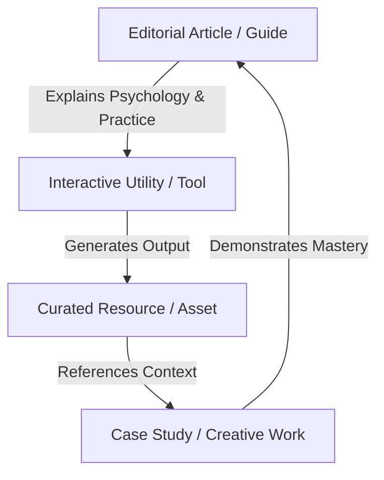

# PRODUCT VISION

## 1. Vision Statement
To establish **Rvan.me** as the definitive modern digital product at the intersection of **Design, Marketing, Psychology, and Culture**.

The platform is designed to be an authoritative editorial publication, an essential creative utility suite, and an open-access resource hub that creators, marketers, engineers, and digital founders return to daily.

---

## 2. Strategic Objectives

### 1. Organic Search Authority (SEO Flywheel)
* Create deep, evergreen, research-backed content that captures high-intent searches.
* Avoid generic AI filler: every article, tool, and directory must provide tangible, actionable, differentiated value.
* Implement programmatic SEO responsibly: indexable tools, font detail pages, and curated directories with structured metadata and fast load times.

### 2. The Interconnected Ecosystem
Users do not enter dead-end pages. Every node in the product feeds another:

### 3. Absolute Quality Standard
* **Zero Fake Functionality**: No mock AI tools, no simulated buttons, no fake testimonial quotes, no empty "coming soon" placeholders.
* **Flawless Client-Side Performance**: Instant reactivity, minimal bundle weights, optimized image pipelines (WebP/AVIF), and zero layout shifts (CLS).
* **Respect for Privacy**: Transparent cookie preferences, minimal tracking overhead, and client-side processing for private data (such as Resume Builder).

---

## 3. Pillar Deep Dive

### Pillar A: LEARN (The Modern Design & Tech Publication)
* **Target Audience**: Mid-to-senior designers, tech leads, growth marketers, and product founders.
* **Core Topics**:
  - *Psychological Design*: Cognitive load, Gestalt visual hierarchy, neuro-aesthetics, pricing tiers framing.
  - *Engineering Polish*: Micro-interactions, motion physics, typography rendering, accessibility contrast.
  - *Growth & Performance*: Conversion rate optimization, ATS recruitment parsing, branding differentiation.
* **Format**: Long-form editorial essays with rich visual diagrams, data tables, code/specimen embeds, and executive takeaways.

### Pillar B: USE (High-Utility Interactive Suite)
* **ATS Resume / CV Builder**:
  - Pure client-side PDF compilation (zero server roundtrip, 100% data privacy).
  - Pre-tested ATS layout parsers, dual language support (EN / AZ), and instant print-safe PDF export.
* **Open Peeps Character Customizer**:
  - Real-time SVG vector rendering of Pablo Stanley's open-source character illustrations.
  - Granular layer customization (head, expression, body, hair, accessories) and multi-format vector exports.
* **Future Pipeline**:
  - *Fluid Typography Scale Generator*: Calculate responsive clamp() values with live code preview.
  - *Color & WCAG Contrast Matrix*: Real-time APCA and WCAG 2.2 accessibility scoring for design systems.
  - *CTA & Headline Impact Evaluator*: Practical checklist & scoring for high-converting marketing copy.

### Pillar C: DISCOVER (Open Resource Hub)
* **1,700+ Google Fonts Directory**: Interactive specimen sandbox, weight comparisons, variable axes, and one-click embed code.
* **Vector Icon & Illustration Vault**: Searchable Lucide icons and Open Doodles vector artwork.
* **Opportunities & AI Directory**: Curated global remote design jobs, international fellowships, and verified AI productivity tools.

---

## 4. Internationalization Commitment
* **First-Class Bilingual Architecture**:
  - English (`/`) targets the global creative and tech audience.
  - Azerbaijani (`/az`) provides the most comprehensive, professionally written, and culturally aligned creative publication and toolset in Azerbaijan.
* Both language trees share 100% feature parity, canonical linking, alternate hreflang tags, and dedicated localized metadata.
