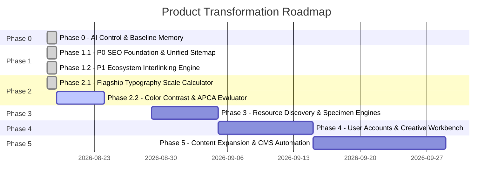

# PRODUCT ROADMAP & STRATEGIC EXECUTION

## Vision Phase Map

---

## Phase 0: AI Project Control & Baseline Memory (COMPLETED)
* **Goal**: Establish deterministic repository memory and verify build baseline.
* **Deliverables**:
  - [x] Create `AI/` control suite (`PROJECT_CONTEXT.md`, `PRODUCT_VISION.md`, `ARCHITECTURE.md`, `DESIGN_SYSTEM.md`, `ROADMAP.md`, `CURRENT_STATE.md`, `DECISIONS.md`, `RULES.md`, `TASKS.md`, `AUDITS/`).
  - [x] Conduct comprehensive Organic Growth & Product Architecture Audit (`AI/AUDITS/ORGANIC_GROWTH_AUDIT.md`).
  - [x] Validate production build integrity (`npm run build` passing cleanly).

---

## Phase 1.1: P0 Organic SEO Foundation & Sitemap Unification (COMPLETED)
* **Goal**: Fix sitemap divergence, consolidate canonical URLs, protect admin routes with `noindex`, and implement two-tier font indexation.
* **Deliverables**:
  - [x] `SITEMAP-01` (P0): Removed proxy rewrite in `vercel.json`; serve unified `dist/sitemap.xml` with 1,095 high-value indexable URLs across EN & AZ with exact `hreflang` tags.
  - [x] `CANONICAL-01` (P0): 301 permanent redirects from `/profile` and `/ravanmammadov` to `/ravan-mammadov` (and `/az` equivalents); internal links updated across header, footer, project detail, and work sections.
  - [x] `ADMIN-01` (P0): Injected `<meta name="robots" content="noindex, nofollow" />` on `/admin/linkedin` and `/az/admin/linkedin` and removed them from sitemap.
  - [x] `FONT-TIER-01` (P0): Curated Top 200 Google Fonts for indexation with rich localized metadata, while marking long-tail fonts `noindex, follow` to protect crawl budget.
  - [x] Documented architecture in `ADR-008`.

---

## Phase 1.2: P1 Ecosystem Interlinking Engine (COMPLETED)
* **Goal**: Maximize user dwell time and crawl depth by interconnecting all 39 master essays with relevant tools and resources.
* **Deliverables**:
  - [x] `INTERLINK-01` (P1): Created `EcosystemBridgeCard.tsx` and mapped all 39 master editorial essays in `src/lib/ecosystemRelationshipMap.ts`.
  - [x] 156 reciprocal topical relationships (4 related essays per article) with 0 orphan articles.
  - [x] 28 contextual tool bridges (72%) and 26 curated resource bridges (67%).
  - [x] Upgraded `RelatedPosts.tsx` and `BlogDetail.tsx` with full bilingual EN & AZ support.
  - [x] Documented architecture in `ADR-009`.

---

## Phase 2.1: Flagship Typography Scale & Clamp Calculator (COMPLETED)
* **Goal**: Launch a production-grade, mathematically harmonic responsive type scale and CSS clamp() generator.
* **Deliverables**:
  - [x] `TOOL-TYPE-01` (P1): Pure client-side mathematical calculation engine (`typeScaleEngine.ts`) with 8 modular scale presets and exact rem-based `clamp()` expressions.
  - [x] Interactive controls panel (`TypeScaleControls.tsx`) with range inputs, custom ratios, base font sizes, and typeface switcher.
  - [x] Live editable typography specimen canvas (`TypeScaleHierarchyPreview.tsx`) and simulated viewport ruler (`TypeScaleViewportSimulator.tsx`).
  - [x] Multi-format code exporter (`TypeScaleCodeExporter.tsx`) for CSS variables, utility classes, and Tailwind config with copy and download.
  - [x] Educational SEO landing page with deep guidance on modular scales, clamp math, accessibility zoom, and reciprocal ecosystem links.
  - [x] Full static pre-rendering on `/tools/typography-scale` and `/az/tools/typography-scale`, registered in `sitemap.xml`.
  - [x] Documented architecture in `ADR-010`.

---

## Phase 2.2: Color Contrast & APCA Matrix Evaluator (UPCOMING)
* **Goal**: Build an advanced color contrast matrix tool supporting WCAG 2.2 and APCA algorithms with theme token exporter.
* **Key Tasks**:
  - [ ] `TOOL-APCA-01` (P1): Color Contrast & APCA Matrix Evaluator (`/tools/contrast-matrix`).
  - [ ] `TOOL-CTA-01` (P2): Marketing Headline & CTA Impact Analyzer (`/tools/headline-analyzer`).
  - [ ] `TOOL-RESUME-01` (P2): ATS Resume Builder drag-and-drop reordering.
  - [ ] `BUNDLE-OPT-01` (P2): Split root `index.js` into sub-route chunks.
