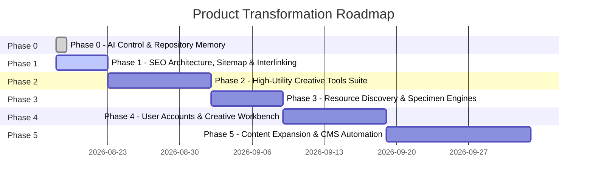

# PRODUCT ROADMAP & STRATEGIC EXECUTION

## Vision Phase Map

---

## Phase 0: AI Project Control & Baseline Memory (COMPLETED)
* **Goal**: Establish deterministic repository memory and verify build baseline.
* **Deliverables**:
  - [x] Create `AI/` control suite (`PROJECT_CONTEXT.md`, `PRODUCT_VISION.md`, `ARCHITECTURE.md`, `DESIGN_SYSTEM.md`, `ROADMAP.md`, `CURRENT_STATE.md`, `DECISIONS.md`, `RULES.md`, `TASKS.md`, `AUDITS/`).
  - [x] Conduct comprehensive Organic Growth & Product Architecture Audit (`AI/AUDITS/ORGANIC_GROWTH_AUDIT.md`).
  - [x] Validate production build integrity (`npm run build` passing cleanly).

---

## Phase 1: SEO Architecture, Sitemap Unification & Ecosystem Interlinking (CURRENT)
* **Goal**: Maximize search crawl efficiency, resolve sitemap edge delivery conflicts, and interconnect all 39 master essays with relevant tools and resources.
* **Key Tasks**:
  - [ ] `SITEMAP-01` (P0): Unify `api/sitemap.ts` and `scripts/generate-seo-pages.mjs` to ensure production bots receive all 39 EN/AZ essays, tools, and curated resources with `hreflang` alternates.
  - [ ] `CANONICAL-01` (P0): Consolidate duplicate founder profile URLs (`/profile`, `/ravanmammadov` → `/ravan-mammadov`) and inject `<meta name="robots" content="noindex" />` on admin routes (`/admin/linkedin`).
  - [ ] `INTERLINK-01` (P1): Embed contextual "Interactive Utility Bridge" cards inside all 39 master essays connecting each article to related tools and resources.
  - [ ] `FONT-TIER-01` (P1): Implement two-tier font indexation (Index Top 200 high-search fonts in sitemap; serve long-tail catalog via dynamic SPA to protect crawl budget).
  - [ ] `BUNDLE-OPT-01` (P2): Split root `index.js` into sub-route chunks to optimize mobile Core Web Vitals (LCP).

---

## Phase 2: High-Utility Creative Tools Suite Expansion
* **Goal**: Expand the **USE** pillar with production-grade, zero-fluff utilities that attract high-intent organic search queries.
* **Key Tasks**:
  - [ ] `TOOL-TYPE-01` (P1): Build **Fluid Typography & Clamp Calculator** (`/tools/typography-scale`) with live visual scaler, modular scale presets, and CSS export.
  - [ ] `TOOL-APCA-01` (P1): Build **Color Contrast & APCA Matrix Evaluator** (`/tools/contrast-matrix`) with WCAG 2.2 / APCA scoring and Tailwind export.
  - [ ] `TOOL-CTA-01` (P2): Build **Marketing Headline & CTA Impact Analyzer** (`/tools/headline-analyzer`) with cognitive scoring.
  - [ ] `TOOL-RESUME-01` (P2): Add section drag-and-drop reordering and JSON backup to **ATS Resume Builder**.

---

## Phase 3: Resource Discovery & Specimen Engine Deepening
* **Goal**: Turn the **DISCOVER** pillar into the most intuitive, fast creative resource catalog on the web.
* **Key Tasks**:
  - [ ] `DISCOVERY-01` (P1): Implement global command palette / fuzzy search (`Cmd/Ctrl + K`) across all tools, articles, and fonts.
  - [ ] `SPECIMEN-01` (P2): Add variable font axis sliders (Weight, Width, Slant, Optical Size) and curated font pairing recommendations on font detail pages.
  - [ ] `ICON-01` (P2): Add direct one-click code copy (SVG, React JSX snippet, Tailwind class) to Lucide icon specimen cards.

---

## Phase 4: User Accounts & Creative Workbench (Value-Driven Auth)
* **Goal**: Transform Google Authentication into a high-value personalization feature.
* **Key Tasks**:
  - [ ] `AUTH-01` (P2): Enable users to bookmark articles and save custom font pairings.
  - [ ] `AUTH-02` (P2): Enable cloud synchronization for ATS Resume Builder drafts linked to user Google account with local storage fallback.
  - [ ] `AUTH-03` (P3): Create "My Creative Workbench" profile dashboard.

---

## Phase 5: Editorial Content Expansion & Sanity CMS Automation
* **Goal**: Deepen topical authority with ongoing high-caliber essays and automated syndication.
* **Key Tasks**:
  - [ ] `CMS-01` (P3): Upgrade Sanity schemas to include formal relational references for Authors, Related Tools, and Topic Clusters.
  - [ ] `AUTO-01` (P3): Automate LinkedIn publishing queue via scheduled Vercel cron endpoints.
