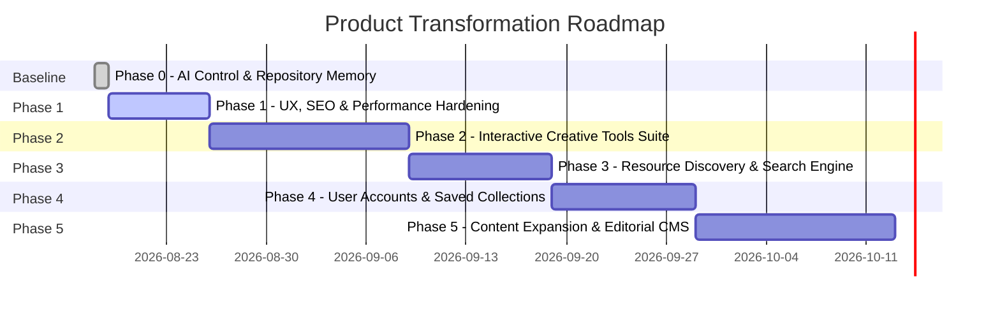

# PRODUCT ROADMAP & EXECUTION PHASES

## Vision Phase Map

---

## Phase 0: AI Project Control & Baseline Memory (CURRENT)
* **Goal**: Establish deterministic, authoritative repository documentation and verify current production build baseline.
* **Deliverables**:
  - [x] Create `AI/` control suite (`PROJECT_CONTEXT.md`, `PRODUCT_VISION.md`, `ARCHITECTURE.md`, `DESIGN_SYSTEM.md`, `ROADMAP.md`, `CURRENT_STATE.md`, `DECISIONS.md`, `RULES.md`, `TASKS.md`, `AUDITS/`).
  - [x] Audit existing 4,719 pre-rendered routes, Sanity CMS queries, i18n dictionaries, and tools.
  - [x] Validate production build integrity (`npm run build` passing in 33s).
  - [x] Commit checkpoint to Git.

---

## Phase 1: UX, SEO Architecture & Performance Hardening
* **Goal**: Maximize search crawlability, eliminate all edge-case layout issues, and ensure lightning-fast Core Web Vitals.
* **Key Tasks**:
  - Audit dynamic metadata across all 4,700+ routes for Google Rich Results compliance.
  - Optimize client hydration and reduce main bundle size (`index-*.js`) via aggressive code splitting.
  - Enhance mobile drawer navigation and touch interactions on small viewport devices.
  - Validate OpenGraph images and Twitter preview cards across all social sharing endpoints.
  - Verify complete Azerbaijani translation coverage across all remaining sub-routes.

---

## Phase 2: High-Utility Creative Tools Suite Expansion
* **Goal**: Expand the **USE** pillar with production-grade, zero-fluff utilities that attract consistent organic search traffic.
* **Key Tasks**:
  - **Tool 1: Fluid Typography & Clamp Calculator**:
    * Interactive visual scaler computing min/max viewport clamp values for CSS.
    * Preset modular scales (Golden Ratio, Minor Third, Major Third).
  - **Tool 2: Color Contrast & APCA Matrix Generator**:
    * Multi-shade color palette accessibility evaluator with WCAG 2.2 and APCA scoring.
    * One-click CSS/Tailwind color token export.
  - **Tool 3: Marketing Headline & CTA Power Analyzer**:
    * Cognitive score evaluator measuring power words, length, emotional sentiment, and reading grade level.
  - **Tool 4: ATS Resume Builder Upgrades**:
    * Add 2 new HR-tested template layouts.
    * Add custom section reordering via drag-and-drop.
    * Add JSON import/export for local resume backup.

---

## Phase 3: Resource Discovery & Search Engine Deepening
* **Goal**: Turn the **DISCOVER** pillar into the most intuitive creative resource catalog on the web.
* **Key Tasks**:
  - Implement instantaneous, client-side fuzzy search with keyboard shortcut (`Cmd/Ctrl + K`) across all tools, fonts, icons, and articles.
  - Add variable font axis playground (Weight, Width, Slant, Optical Size) on individual font detail pages.
  - Add instant multi-format icon export (React JSX snippet, SVG code, Data URI).
  - Add community curation filter for verified open-source design repositories.

---

## Phase 4: User Accounts & Saved Collections (Value-Driven Auth)
* **Goal**: Transform Google Authentication from a simple login into a high-value personalization feature.
* **Key Tasks**:
  - Enable users to save favorite articles, bookmark fonts, and pin useful tools.
  - Create personal "My Creative Stack" collections.
  - Store Resume Builder drafts securely in user profile (with local storage sync).
  - Enable personalized comment notifications and discussion threads.

---

## Phase 5: Editorial Content Expansion & Sanity CMS Automation
* **Goal**: Deepen topical authority with ongoing, high-caliber essays and automated multi-channel syndication.
* **Key Tasks**:
  - Expand publication clusters into new topic pillars (Neuro-marketing, Spatial Design, AI Design Systems).
  - Automate LinkedIn publishing queue via scheduled Vercel cron endpoints.
  - Establish automated broken-link and external asset health monitors.
