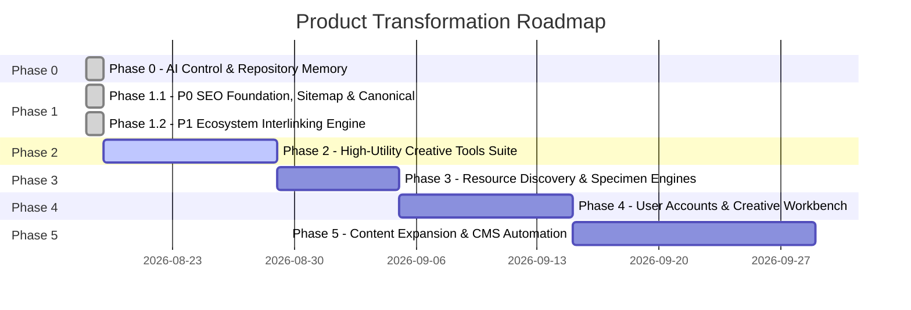

# PRODUCT ROADMAP & STRATEGIC EXECUTION

## Vision Phase Map

---

## Phase 0: AI Project Control & Baseline Memory (COMPLETED)
* **Goal**: Establish deterministic repository memory and verify build baseline.
* **Deliverables**:
  - [x] Create `AI/` control suite (`PROJECT_CONTEXT.md`, `PRODUCT_VISION.md`, `ARCHITECTURE.md`, `DESIGN_SYSTEM.md`, `ROADMAP.md`, `CURRENT_STATE.md`, `DECISIONS.md`, `RULES.md`, `TASKS.md`, `AUDITS/`).
  - [x] Conduct comprehensive Organic Growth & Product Architecture Audit (`AI/AUDITS/ORGANIC_GROWTH_AUDIT.md`).
  - [x] Validate production build integrity (`npm run build` passing cleanly).

---

## Phase 1.1: P0 Organic SEO Foundation & Sitemap Unification (COMPLETED)
* **Goal**: Fix sitemap divergence, consolidate canonical URLs, protect admin routes with `noindex`, and implement two-tier font indexation.
* **Deliverables**:
  - [x] `SITEMAP-01` (P0): Removed proxy rewrite in `vercel.json`; serve unified `dist/sitemap.xml` with 1,095 high-value indexable URLs across EN & AZ with exact `hreflang` tags.
  - [x] `CANONICAL-01` (P0): 301 permanent redirects from `/profile` and `/ravanmammadov` to `/ravan-mammadov` (and `/az` equivalents); internal links updated across header, footer, project detail, and work sections.
  - [x] `ADMIN-01` (P0): Injected `<meta name="robots" content="noindex, nofollow" />` on `/admin/linkedin` and `/az/admin/linkedin` and removed them from sitemap.
  - [x] `FONT-TIER-01` (P0): Curated Top 200 Google Fonts for indexation with rich localized metadata, while marking long-tail fonts `noindex, follow` to protect crawl budget.
  - [x] Documented architecture in `ADR-008`.

---

## Phase 1.2: P1 Ecosystem Interlinking Engine (COMPLETED)
* **Goal**: Maximize user dwell time and crawl depth by interconnecting all 39 master essays with relevant tools and resources.
* **Deliverables**:
  - [x] `INTERLINK-01` (P1): Created `EcosystemBridgeCard.tsx` and mapped all 39 master editorial essays in `src/lib/ecosystemRelationshipMap.ts`.
  - [x] 156 reciprocal topical relationships (4 related essays per article) with 0 orphan articles.
  - [x] 28 contextual tool bridges (72%) and 26 curated resource bridges (67%).
  - [x] Upgraded `RelatedPosts.tsx` and `BlogDetail.tsx` with full bilingual EN & AZ support.
  - [x] Documented architecture in `ADR-009`.

---

## Phase 2: High-Utility Creative Tools Suite Expansion (UPCOMING)
* **Goal**: Expand the **USE** pillar with production-grade, zero-fluff utilities that attract high-intent organic search queries.
* **Key Tasks**:
  - [ ] `TOOL-TYPE-01` (P1): Build **Fluid Typography & Clamp Calculator** (`/tools/typography-scale`) with live visual scaler, modular scale presets, and CSS export.
  - [ ] `TOOL-APCA-01` (P1): Build **Color Contrast & APCA Matrix Evaluator** (`/tools/contrast-matrix`) with WCAG 2.2 / APCA scoring and Tailwind export.
  - [ ] `TOOL-CTA-01` (P2): Build **Marketing Headline & CTA Impact Analyzer** (`/tools/headline-analyzer`) with cognitive scoring.
  - [ ] `TOOL-RESUME-01` (P2): Add section drag-and-drop reordering and JSON backup to **ATS Resume Builder**.
  - [ ] `BUNDLE-OPT-01` (P2): Split root `index.js` into sub-route chunks to optimize mobile Core Web Vitals (LCP).

---

## Phase 3: Resource Discovery & Specimen Engine Deepening
* **Goal**: Turn the **DISCOVER** pillar into the most intuitive, fast creative resource catalog on the web.
* **Key Tasks**:
  - [ ] `DISCOVERY-01` (P1): Implement global command palette / fuzzy search (`Cmd/Ctrl + K`) across all tools, articles, and fonts.
  - [ ] `SPECIMEN-01` (P2): Add variable font axis sliders (Weight, Width, Slant, Optical Size) and curated font pairing recommendations on font detail pages.
  - [ ] `ICON-01` (P2): Add direct one-click code copy (SVG, React JSX snippet, Tailwind class) to Lucide icon specimen cards.

---

## Phase 4: User Accounts & Creative Workbench (Value-Driven Auth)
* **Goal**: Transform Google Authentication into a high-value personalization feature.
* **Key Tasks**:
  - [ ] `AUTH-01` (P2): Enable users to bookmark articles and save custom font pairings.
  - [ ] `AUTH-02` (P2): Enable cloud synchronization for ATS Resume Builder drafts linked to user Google account with local storage fallback.
  - [ ] `AUTH-03` (P3): Create "My Creative Workbench" profile dashboard.

---

## Phase 5: Editorial Content Expansion & Sanity CMS Automation
* **Goal**: Deepen topical authority with ongoing high-caliber essays and automated syndication.
* **Key Tasks**:
  - [ ] `CMS-01` (P3): Upgrade Sanity schemas to include formal relational references for Authors, Related Tools, and Topic Clusters.
  - [ ] `AUTO-01` (P3): Automate LinkedIn publishing queue via scheduled Vercel cron endpoints.
